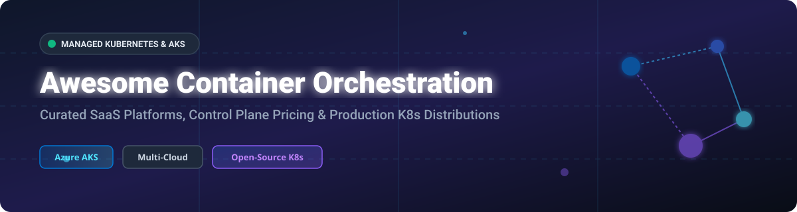

# 🚀 Awesome Container Orchestration & Managed Kubernetes (AKS)

  
  
  
  
  

A curated list of **SaaS Container Orchestration Platforms**, **Managed Kubernetes Services (AKS, EKS, GKE)**, **Control Plane Pricing Economics**, and **Self-Hosted Open-Source Kubernetes Distributions**.

---

## 📖 Table of Contents
- [☁️ Managed Kubernetes & SaaS Platforms](#️-managed-kubernetes--saas-platforms)
- [🔓 Open-Source Kubernetes Distributions & Tooling](#-open-source-kubernetes-distributions--tooling)
- [🤝 How to Contribute](#-how-to-contribute)
- [💖 Support & Community](#-support--community)
- [⭐ Star History](#-star-history)
- [⚠️ Disclaimer](#%EF%B8%8F-disclaimer)

---

## ☁️ Managed Kubernetes & SaaS Platforms

> **📊 Market Context & Market Size**: The global managed Kubernetes services market is estimated at **~$6B in 2026** and projected to grow to **~$20B+ by 2032** at a ~22% CAGR. The sector is **moderately concentrated** — dominated at the top tier by hyperscalers (AWS, Azure, Google Cloud), but balanced by challenger platforms (DigitalOcean, Scaleway, Linode) competing aggressively on **free control planes** and simplified bandwidth pricing. Multi-cloud requirements and enterprise sovereign cloud policies prevent a winner-take-all monopoly.

### 🌐 SaaS & Managed Kubernetes Platform Comparison

*Platforms sorted by company revenue / valuation in descending order.*

| Platform | Description | Pricing (Starting Tier) | Free Tier Limits | Company Size / Valuation |
|---|---|---|---|---|
| **[Amazon EKS](https://aws.amazon.com/eks/)** | AWS managed Kubernetes service. Auto Mode automates node provisioning; Provisioned Control Plane supports ultra-large workloads. | **$0.10/hour per cluster** (~$73/month). Auto Mode adds **$0.172/hour** management fee. | **No perpetual free tier**; EKS Hybrid Nodes offer **$0.02/vCPU/hour** for on-premises nodes. | **~$638B revenue** (Amazon FY2025) |
| **[Google Kubernetes Engine (GKE)](https://cloud.google.com/kubernetes-engine)** | Google Cloud managed Kubernetes. Offers Autopilot (pod-level billing) and Standard mode (full cluster control). | **$0.10/hour per cluster** (~$73/month). Autopilot billed on CPU/RAM pod requests. | **$74.40/month credit** per billing account (covers 1 zonal Standard or Autopilot cluster). | **~$350B revenue** (Alphabet FY2025) |
| **[Azure Kubernetes Service (AKS)](https://azure.microsoft.com/en-us/products/kubernetes-service)** | Microsoft's enterprise managed Kubernetes. Supports dev/test free control planes, standard SLA tiers, and 24-month LTS. | **Free tier**: $0 control plane. **Standard tier**: ~$0.10/hour (~$73/month). | **Free dev/test tier**: No control plane charge, up to 1,000 nodes, best-effort SLA. | **~$281B revenue** (Microsoft FY2025) |
| **[VMware Tanzu](https://tanzu.vmware.com/)** | Broadcom enterprise Kubernetes platform integrated into VMware Cloud Foundation (VCF 9). | **~$350/core/year** under VCF 9 bundle (minimum 16-core-per-CPU billing). | **No perpetual free tier** (Tanzu Community Edition discontinued). 30-day evaluation. | **~$51B revenue** (Broadcom parent) |
| **[Scaleway Kapsule](https://www.scaleway.com/en/kubernetes/)** | European managed Kubernetes with full CNCF compliance and transparent data sovereignty. | **Free control plane**. Worker nodes from **€0.027/hour** (~€19.71/month). | **Free control plane forever** + **75 GB free monthly egress**. | **~$10B revenue** (Iliad Group parent) |
| **[Linode Kubernetes Engine (LKE)](https://www.linode.com/products/kubernetes/)** | Akamai Cloud managed Kubernetes service with predictable node billing and optional HA control plane. | **Free standard control plane**. HA control plane **$60/month**. Worker nodes from **$5/month**. | **Free standard control plane forever** + **$100 free credit (60 days)** for new users. | **~$4B revenue** (Akamai parent) |
| **[Red Hat OpenShift](https://www.redhat.com/en/technologies/cloud-computing/openshift)** | Enterprise hybrid cloud Kubernetes platform with integrated security, CI/CD, and developer portal. | **$9,549.99/year** self-managed (1-2 sockets up to 128 cores). ROSA / ARO quote-based. | **OpenShift Local**: Free local sandbox. **30-day full-featured self-managed trial**. | **~$4B revenue** (Red Hat FY2025) |
| **[DigitalOcean Kubernetes (DOKS)](https://www.digitalocean.com/products/kubernetes)** | Developer-focused managed Kubernetes with automated cluster scaling and integrated block storage. | **Free control plane**. HA control plane **$40/month**. Nodes from **$12/month** (1 vCPU, 2GB). | **Free control plane forever** + **2,000 GiB free egress/node/month**. | **~$700M revenue** (DOCN) |
| **[SUSE Rancher Prime](https://www.suse.com/products/suse-rancher-prime/)** | Enterprise multi-cluster Kubernetes management platform for multi-cloud, on-premises, and edge environments. | **$7,112.25/year** (Standard tier, 1-2 sockets up to 64 cores). | **Rancher Desktop**: Free forever for local dev. **30-day Rancher Prime trial**. | **~$600M revenue** (SUSE est.) |
| **[Canonical Kubernetes](https://ubuntu.com/kubernetes/managed)** | Fully managed enterprise Kubernetes service from Canonical supporting multi-cloud and bare-metal deployments. | Quote-based enterprise managed service with 99.9% uptime SLA. | **MicroK8s**: Free forever for local/edge dev. **Managed service**: 30-day trial. | **~$200M revenue** (Canonical est.) |

---

## 🔓 Open-Source Kubernetes Distributions & Tooling

*Sorted by GitHub Stars_Count in descending order. Stars_Badges link directly to each repository's stargazers page.*

| Repo | Description | GitHub_Stars |
|---|---|---|
| **[Kubernetes](https://github.com/kubernetes/kubernetes)** | **The foundational container orchestration engine.** Production-grade, battle-tested, standard setter for cloud-native computing. Apache-2.0. |  |
| **[Minikube](https://github.com/kubernetes/minikube)** | **Local Kubernetes engine.** Fast, multi-driver local K8s cluster generator for macOS, Linux, and Windows. Apache-2.0. |  |
| **[K3s](https://github.com/k3s-io/k3s)** | **Lightweight CNCF-certified Kubernetes.** Single binary under 100 MB, optimized for ARM, edge, IoT, and CI/CD pipelines. Apache-2.0. |  |
| **[Talos Linux](https://github.com/siderolabs/talos)** | **Secure, immutable, API-driven Kubernetes OS.** Minimal attack surface, zero SSH access, built entirely for K8s. MPL-2.0. |  |
| **[Kubespray](https://github.com/kubernetes-sigs/kubespray)** | **Production Kubernetes cluster deployment tool.** Ansible-based automation for AWS, GCP, Azure, OpenStack, and bare metal. Apache-2.0. |  |
| **[Kind](https://github.com/kubernetes-sigs/kind)** | **Kubernetes IN Docker.** Local cluster runner using Docker container nodes, designed for testing Kubernetes itself. Apache-2.0. |  |
| **[MicroK8s](https://github.com/canonical/microk8s)** | **Zero-ops lightweight Kubernetes by Canonical.** Single snap package, production-grade, automatic updates. Apache-2.0. |  |
| **[K0s](https://github.com/k0sproject/k0s)** | **Zero-friction single-binary Kubernetes by Mirantis.** Pure K8s distribution with no host OS dependencies. Apache-2.0. |  |
| **[KubeKey](https://github.com/kubesphere/kubekey)** | **Single-command K8s installer by KubeSphere.** Supports multi-node, air-gapped, and cloud-native cluster setups. Apache-2.0. |  |
| **[OKD](https://github.com/okd-project/okd)** | **The Origin Community Distribution of Kubernetes.** Upstream community distribution powering Red Hat OpenShift. Apache-2.0. |  |
| **[SIGHUP Distribution](https://github.com/sighupio/fury-distribution)** | **CNCF-certified enterprise K8s distribution.** Pure upstream Kubernetes with modular add-ons for observability and networking. Apache-2.0. |  |
| **[Typhoon](https://github.com/poseidon/typhoon)** | **Minimal free Kubernetes distribution for cloud and bare metal.** Terraform-driven Kubernetes clusters on AWS, Azure, GCP, DigitalOcean. Apache-2.0. |  |

---

## 🤝 How to Contribute

1. **Fork** the repository.
2. Edit `README.md` following the existing markdown table structure.
3. Include: Tool Name, URL link, factual description, starting price tier, free tier limits, and company size.
4. Open a Pull Request with a clear description of your additions or pricing updates.

Check out our full awesome ecosystem collection at [Awesome-Awesome-Awesome](https://github.com/ishandutta2007/Awesome-Awesome-Awesome).

---

## 💖 Support & Community

Thank you for exploring **Awesome Container Orchestration & Managed Kubernetes (AKS)**! If this repository helps you evaluate container orchestration options or optimize cloud infrastructure costs, please consider supporting the project:

- ⭐ **Star** this repository to help others discover it.
- 🍴 **Fork** and submit Pull Requests to keep pricing and distribution data updated.
- 📢 **Share** with your platform engineering, DevOps, and cloud architecture teams.
- ☕ **Sponsor / Buy me a coffee**: Support ongoing open-source maintenance via the [GitHub Sponsor Dashboard](https://github.com/sponsors/ishandutta2007).

---

## ⭐ Star History

---

## ⚠️ Disclaimer

- This is a **community-curated** resource — not an exhaustive list or direct commercial endorsement.
- All pricing figures and free tier specifications reflect verified vendor documentation as of October 2026 and are subject to change.
- Multi-cloud control plane costs vary by node type, region, and uptime SLAs. Model your core counts and data transfer requirements carefully before committing to enterprise infrastructure contracts.
